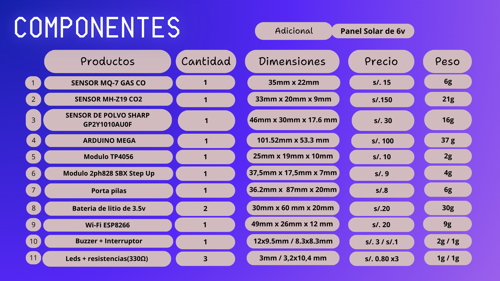
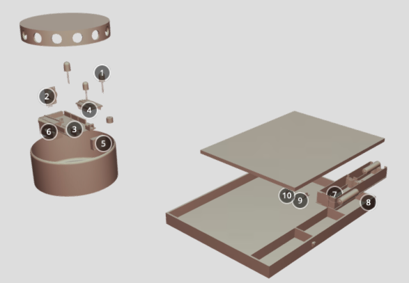

# <h1 align="center">🖋Modelado 3D del Prototipo 🔩</h1>
### Lista de contenido:
* [Tabla de componentes](#tabla-de-componentes)
* [Modelo del prototipo](#modelo-del-prototipo) 
* [Interior del prototipo](#interior-del-prototipado)
* [Ubicación](#ubicación-del-prototipo) 
* [Modelos de los componentes](#componentes) 

## Tabla de componentes

## Modelo del prototipo

 **Figura1. Dispositivos** 

[**Modelo en onshape**](https://cad.onshape.com/documents/174262e779d590e9f69711e3/w/334a1c3685cb40d3d7fd8273/e/c486e682bcecdcdf7f70a628?renderMode=0&uiState=65c09a08430e5650ecdb5713)

## Interior del prototipado

 <a href="https://sketchfab.com/3d-models/componente-delprototipo-426003c9df2746469747df32c877d202?utm_medium=embed&utm_campaign=share-popup&utm_content=426003c9df2746469747df32c877d202" target="_blank" rel="nofollow" style="font-weight: bold; color: #1CAAD9;"> componente_delprototipo </a> by <a href="https://sketchfab.com/sol29?utm_medium=embed&utm_campaign=share-popup&utm_content=426003c9df2746469747df32c877d202" target="_blank" rel="nofollow" style="font-weight: bold; color: #1CAAD9;"> sol29 </a> on <a href="https://sketchfab.com?utm_medium=embed&utm_campaign=share-popup&utm_content=426003c9df2746469747df32c877d202" target="_blank" rel="nofollow" style="font-weight: bold; color: #1CAAD9;">Sketchfab</a>

|N°|Producto|Cantidad|
|:--:|:----:|:----:|
|1|Leds|3|-
|2|Mq-7 Co|1|-
|3|Arduino Mega|1|-
|4|Esp8266|1|-
|5|Módulo MH-Z19B|1|-
|6|GP2Y1010AU0F|1|-
|7|Porta pila|1|
|8|Pila de litio|2|-
|9|2ph828 SBX Step Up|1|
|10|Modulo TP4056|1|-

#### Modelado3D

[**Modelo en onshape**](https://cad.onshape.com/documents/174262e779d590e9f69711e3/w/334a1c3685cb40d3d7fd8273/e/2e112188205770a7f79addcc)

## Ubicación del prototipo
|
Animación interactivad
 
 <a href="https://sketchfab.com/3d-models/prototipo-instalado-753c06a51ffa4db28d9ecfe310c25142?utm_medium=embed&utm_campaign=share-popup&utm_content=753c06a51ffa4db28d9ecfe310c25142" target="_blank" rel="nofollow" style="font-weight: bold; color: #1CAAD9;"> Prototipo instalado </a> by <a href="https://sketchfab.com/doncito?utm_medium=embed&utm_campaign=share-popup&utm_content=753c06a51ffa4db28d9ecfe310c25142" target="_blank" rel="nofollow" style="font-weight: bold; color: #1CAAD9;"> doncito </a> on <a href="https://sketchfab.com?utm_medium=embed&utm_campaign=share-popup&utm_content=753c06a51ffa4db28d9ecfe310c25142" target="_blank" rel="nofollow" style="font-weight: bold; color: #1CAAD9;">Sketchfab</a>

|
Ubicación del prototipo [**Modelo en onshape**](https://cad.onshape.com/documents/174262e779d590e9f69711e3/w/334a1c3685cb40d3d7fd8273/e/2e112188205770a7f79addcc)
 |
|:---:|:--:|

## Componentes

|Modelo del Componente|Enlaces |
|:---|:---|
|Arduino Mega.| Recuperado de https://grabcad.com/library/arduino-mega-11|
|Esp8266.|Recuperado de https://grabcad.com/library/esp-01s-1| 
|Leds. |Recuperado de https://grabcad.com/library/led-3mm-verde-by-oscarml-1|
|MH-Z19.| Recuperado de https://grabcad.com/library/mh-z19b-c02-module-detector-mh-z19-1|
|Módulo 2ph828 SBX Step Up.| Recuperado de https://grabcad.com/library/st6845-c-1|
|MQ-7.| Recuperado de https://grabcad.com/library/mq135-air-sensor-1|
|Pilas. |Recuperado de https://grabcad.com/library/bateria-18650-panasonic-1|
|Sensor de partículas.| Recuperado de https://grabcad.com/library/dust-sensor-gp2y1010au0f-1|
|TP4056.| Recuperado de https://grabcad.com/library/modulo-carga-tipo-c-bateria-de-litio-tp4056-18650-1|
