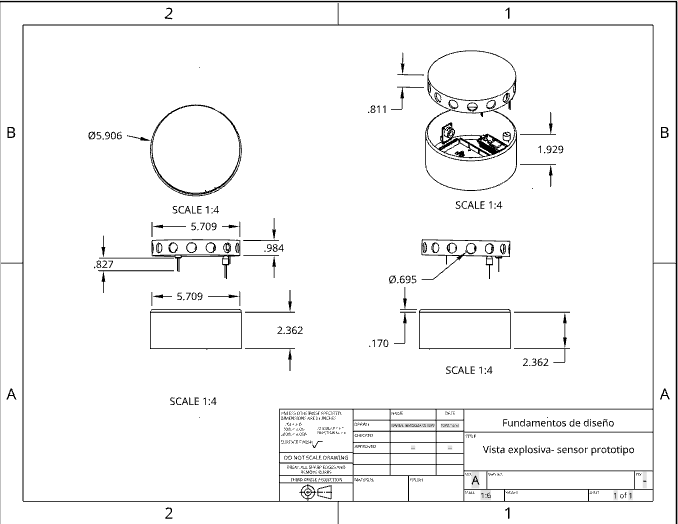

# 🖋Modelado 3D del Prototipo 🔩 
### Lista de contenido:
* [Tabla de componente](#tabla-de-componentes)
* [Modelo del prototipo](#modelo-del-prototipo) 
* [Interior del prototipo](#interior-del-prototipado)
* [Modelos de los componentes](#componentes)

## Tabla de componentes

## Modelo del prototipo
 
 **Figura1. Dispositivos** 

[**Modelo en onshape**](https://cad.onshape.com/documents/174262e779d590e9f69711e3/w/334a1c3685cb40d3d7fd8273/e/c486e682bcecdcdf7f70a628?renderMode=0&uiState=65c09a08430e5650ecdb5713)
### Plano del dispositivo:

### Plano de la fuente:

## Interior del prototipado

## Ubicación del prototipo
|
Animación interactivad
|
Ubicación del prototipo
 |
|:---:|:--:|

 
Prototipo instalado </a> by <a href="https://sketchfab.com/doncito?utm_medium=embed&utm_campaign=share-popup&utm_content=753c06a51ffa4db28d9ecfe310c25142" target="_blank" rel="nofollow" style="font-weight: bold; color: #1CAAD9;"> doncito </a> on <a href="https://sketchfab.com?utm_medium=embed&utm_campaign=share-popup&utm_content=753c06a51ffa4db28d9ecfe310c25142" target="_blank" rel="nofollow" style="font-weight: bold; color: #1CAAD9;">Sketchfab</a>

## Componentes 
