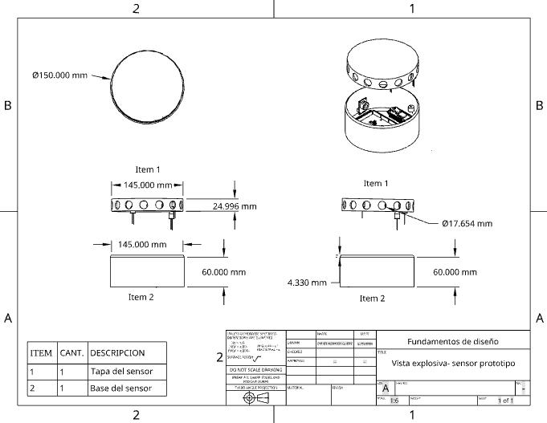

# Planos del Prototipo

## Planos de los componentes

[Original](componente_delprototipo.pdf)
## Plano de la colocación de los sensores

[Original](prototipo_delos_sensores.pdf)
## Visualizacion en el programa CURA

## Plano del almacenamiento

