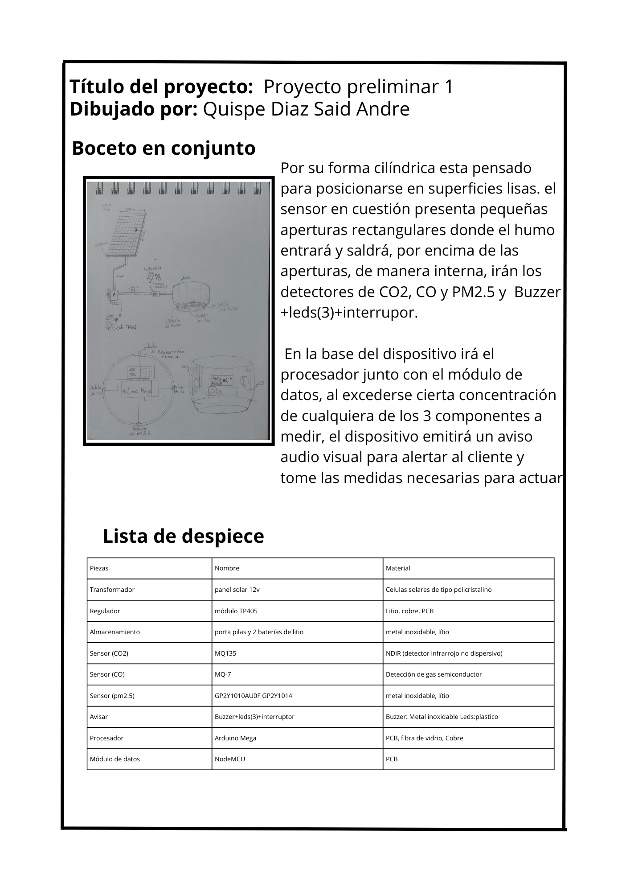
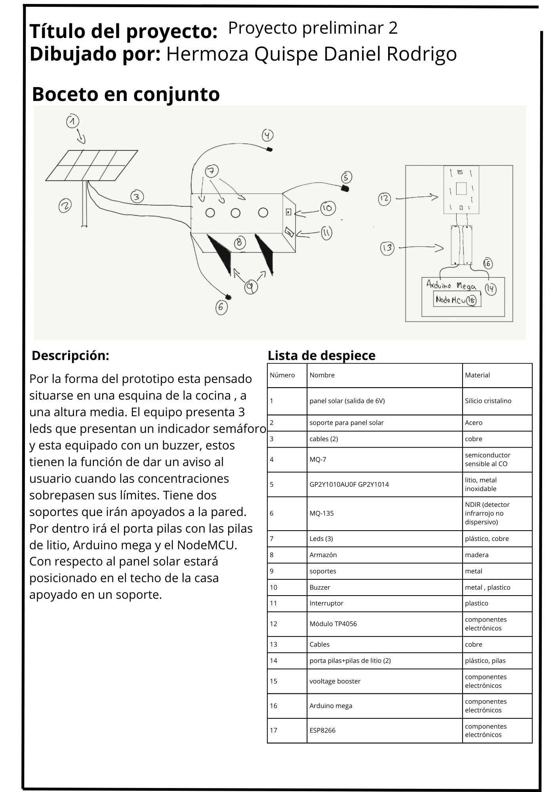
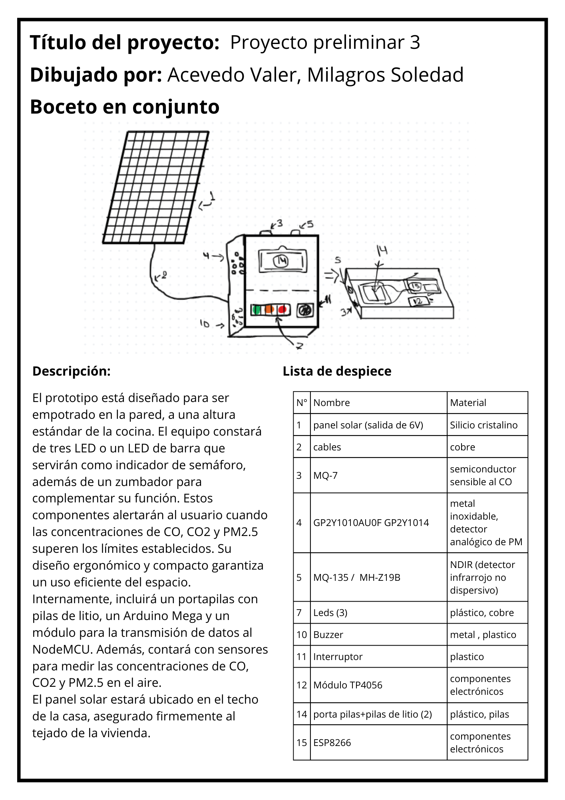
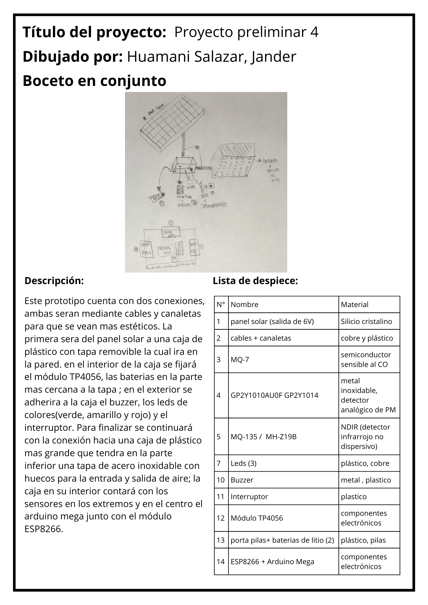
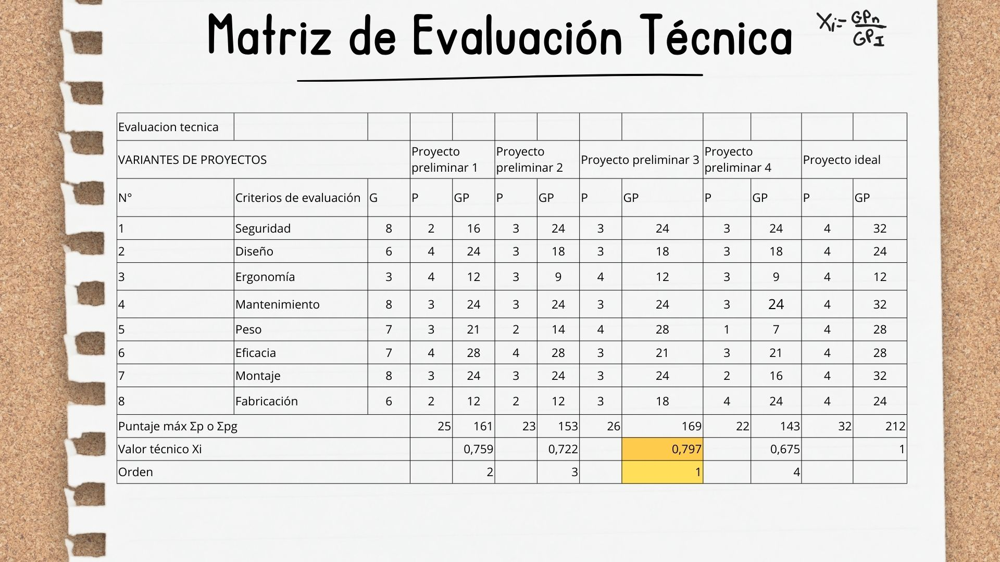
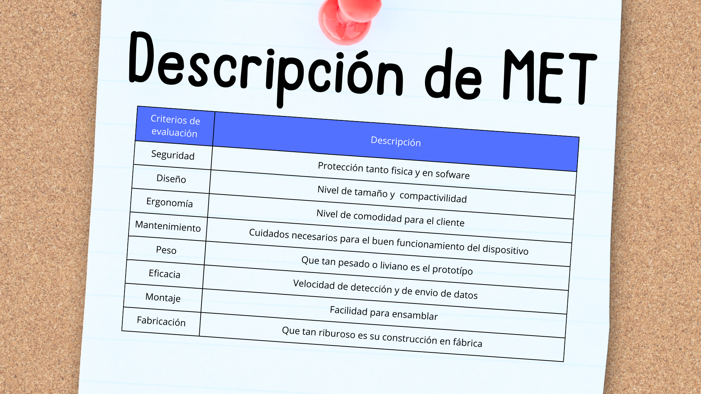
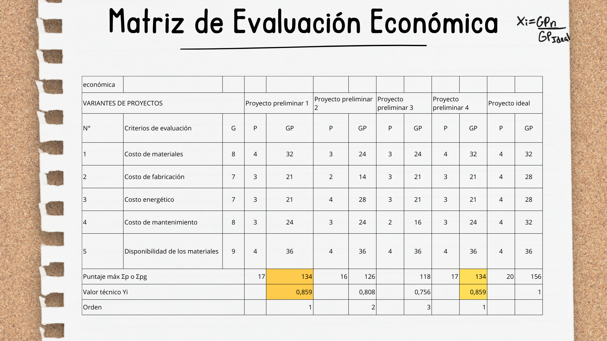
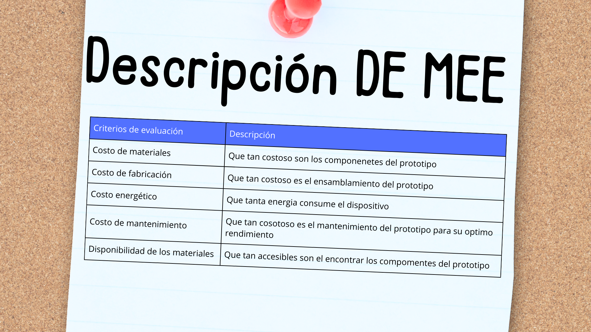
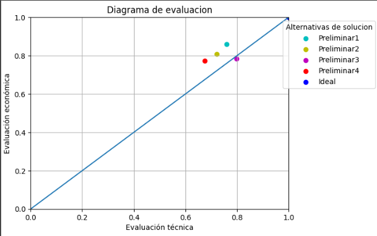

<h1 align="center">🖊Proyectos preliminares🖌</h1>

### Lista de contenido:
* [Bocetos](#bocetosproyectos-preliminares)
  * [Proyecto preliminar 1](#proyecto-preliminar-1)
  * [Proyecto preliminar 2](#proyecto-preliminar-2)
  * [Proyecto preliminar 3](#proyecto-preliminar-3)
  * [Proyecto preliminar 4](#proyecto-preliminar-4)
* [Matriz de evaluación](#matriz-de-evaluación)
    * [Evaluación técnica](#matriz-de-evaluación-técnica)
    * [Evaluación económica](#matriz-de-evaluación-económica)
* [Proyecto óptimo](#proyecto-óptimo) 
* [Conclusión](#conclusión)   

## Bocetos(Proyectos Preliminares)
Los tres proyectos iniciales han sido desarrollados basándose en el concepto de solución más destacado (C.S. 3), que sobresalió en la evaluación establecidos en la tabla de valoración anterior.
### Proyecto preliminar 1:

### Proyecto preliminar 2:

### Proyecto preliminar 3:

### Proyecto preliminar 4:

## Matriz de Evaluación
La evaluación técnico-económica de los tres proyectos preliminares derivados de nuestra solución ganadora se llevó a cabo utilizando la metodología de diseño VDI 2225.
### Matriz de evaluación técnica:

### Descripción: 

### Matriz de evaluación económica:

### Descripción:

## Proyecto óptimo
 Basándonos en los criterios de evaluación considerados, seremos capaces de determinar el proyecto más adecuado para nuestro objetivo.

|N° Proyecto preliminar |Valor técnico Xi |Valor técnico Yi |
|:--:|:--:|:--:|
|Proyecto preliminar 1 | 0,759|0,859| 
|Proyecto preliminar 2|0,722|0,808|
|Proyecto preliminar 3|0,797|0,756|
|Proyecto preliminar 4|0,675|0,859|

## Conclusión
Basándonos en nuestro concepto solución ganador, C.S3, desarrollamos cuatro bocetos con los mismos componentes pero organizados de manera diferente. Tras evaluarlos con los criterios de la tabla, seleccionamos el proyecto preliminar N°1 como ganador al cumplir con los criterios propuestos y nuestras expectativas.

Este proyecto destacó al obtener los puntajes más altos tanto en la matriz teórica (0.809) como en la matriz económica (0.859). Su sólida fundamentación teórica y su viabilidad económica lo posicionaron como la opción más prometedora. Además, su alineación con nuestros objetivos estratégicos fue evidente durante el proceso de evaluación. Por lo tanto, tras un análisis exhaustivo, decidimos que el proyecto preliminar N°1 es nuestra elección final.
