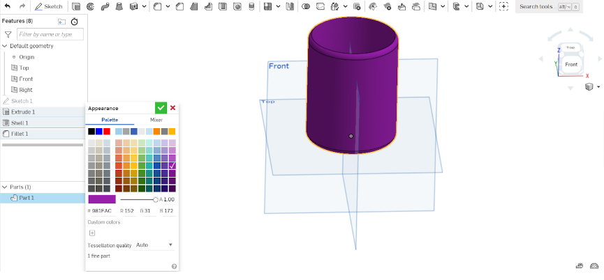

# <h1 align= "center"> **Introducción al modelado 3D**</h1>

### Integrantes:
* Said Andre Quispe Diaz
* Hermoza Quispe, Daniel Rodrigo
* Acevedo Valer, Milagros Soledad
* Jander Huamani Salazar

### Lista de contenido
1. [Introducción](#introducción)
2. [Objetivo](#objetivo) 
3. [Ejecución de la actividad](#ejecución-de-la-actividad)
    1. [Funciones](#funciones-utilizadas-y-su-breve-descripción)
    1. [Diseño de vaso](#diseño-de-vaso)
        * [Creación de cuenta](#creación-de-cuenta)
        * [Actividad 1](#actividad-1)
        * [Creación de nuevo plano](#creación-de-nuevo-plano) 
        * [Actividad 2](#actividad-2)
    2. [Diseño de base para Arduino Uno](#recreando-una-carcasa-para-el-arduino-uno)   
4. [Discusión](#discusión)
5. [Conclusión](#conclusión)

# Introducción
En los últimos años, el avance de la tecnología ha beneficiado de diversas formas en diversos ámbitos de nuestra sociedad, algunos ejemplos son: el uso de drones, el accesos a internet, los teléfonos inteligentes, prótesis médicas accesibles o las impresoras 3D.
Estas últimas han representado una opción viable para la fabricación de objetos en general como prótesis, juguetes, componentes, prototipos, etc. Sin embargo, para que la impresora empiece a fabricar, primero tenemos que enviarle el modelo vía virtual del objeto que queremos que se fabrique, para ello existen diversas plataformas cuyas herramientas nos permiten diseñar de forma intuitiva como la plataforma “Onshape” cuya ventaja sobre la competencia es que no tienes que pagar una suscripción para comenzar a diseñar.

<table class="default" align= "center">
  <tr>
    <td>
Figura 1. Impresora 3D 
</td>
    <td>
Figura 2. Diseño de OnShape 
</td>
  </tr>
</table>

## Objetivo:
En el presente taller, se instruirán sobre las bases aprendidas y algunos ejemplos sobre el uso de la plataforma Onshape para el modelado en 3D de diversos objetos para su próxima producción en impresoras 3D.Permitiendo familiarizarnos con herramientas de diseño 3D y desarrollar habilidades en modelado tridimensional. 
# Ejecución de la actividad
En esta actividad introductoria para el manejo básico de la plataforma Onshape, se abordan dos proyectos clave: el diseño de una base para Arduino Uno y la creación de un vaso. Mientras que el diseño de la base se centra en la funcionalidad y el soporte del dispositivo, el proyecto del vaso explora aspectos estéticos y creativos.
### Funciones utilizadas y su breve descripción:
- **Onshape:** es una plataforma de diseño asistido por computadora (CAD) basada en la nube que permite a los usuarios crear y colaborar en modelos 3D de manera simultánea, accesible desde cualquier dispositivo con conexión a Internet.
- **Extrude (Extrusión):** Operación que implica estirar un perfil bidimensional a lo largo de un eje para crear una forma tridimensional. En OnShape, se utiliza el color rojo para resaltar la geometría no finalizada en un boceto, indicando elementos que requieren ajustes.
- **Revolve (Revolución):** Operación que gira un boceto bidimensional alrededor de un eje para crear una forma tridimensional simétrica. En OnShape, el color azul indica que la geometría está bien construida, pero aún necesita estar completamente definida, como agregar cotas a los lados del boceto.
- **Filleting (Redondeo):** Operación que crea un borde biselado a partir de las aristas de un objeto para evitar esquinas afiladas. La geometría en negro indica que las líneas y la geometría están completamente definidas y resueltas, lista para operaciones de modelado posteriores.
- **Shell (Vaciado):** Operación que crea un espacio hueco o un agujero dentro de una pieza seleccionando una región para eliminar su volumen. En OnShape, se utiliza el color rojo para resaltar la geometría no finalizada, señalando áreas que necesitan ajustes.
- **Dimension (Cota):** Medida o conjunto de medidas que especifica las dimensiones de un objeto. En OnShape, el color azul indica que la geometría está bien construida pero necesita estar completamente definida, como agregar cotas precisas.
### Funciones adicionales:
- **Sweep (Perfil):** Crea una forma 3D moviendo un perfil 2D a lo largo de un camino especificado.
- **Loft (Creación de Sección Transversal):** Crea una forma mezclando entre dos o más perfiles transversales a lo largo de un camino definido.
- **Pattern (Patrón):** Replica características o cuerpos en un arreglo específico.
- **Mirror (Espejo):** Genera una copia reflejada de características o cuerpos seleccionados.
- **Boolean Operations (Operaciones Booleanas):** Combina o sustrae formas utilizando operaciones como unión, intersección o sustracción para crear geometría compleja.
- **Shell (Vaciado):** Crea espacios huecos o elimina material de un sólido, útil para aligerar o agregar características internas.

[Volver al inicio](#lista-de-contenido)

## Diseño de vaso
Para el presente taller utilizaremos un vaso como modelo 3D, hay diversas formas de modelar un vaso, mas para el taller indicaremos dos ejemplos .
### Creación de cuenta:
Antes de iniciar el diseño en la plataforma Onshape, es necesario crear una cuenta. Una vez creada la cuenta, procedemos a seleccionar la opción "Create" para generar un nuevo documento, donde comenzaremos de inmediato a diseñar nuestro modelo 3D.

Imagen 1. Inicio de sección 

  
Si el usuario ya tiene una cuenta, simplemente debe hacer clic en "SIGN IN". Si aún no la tienes, dirígete a la opción "Create a Student Account" y sigue las indicaciones para activar tu cuenta. Continuando con la pantalla de inicio para la creación de los modelos 3D. 

Imagen 2. Portafolio  

Para crear un plano, simplemente ve a "Create", luego selecciona "Document..." y podrás comenzar a crear.

Imagen 3. Programa de diseño 

### Actividad 1
En la parte superior derecha encontrará una un esquema que muestra las                 diversas caras del modelo, en este caso nos ubicamos en la cara “Top”. Seguidamente utilizamos la herramienta sketch, ubicada en la parte superior  izquierda, y seleccionamos la cara “top”, se hace esto para poder utilizar herramientas de diseño 2D solamente en 
dicha cara.

Imagen 4. Plano de Top(Arriba) 

Ahora seleccionamos la herramienta “Center point circle” para crear un círculo, después seleccionamos la herramienta “Dimension” para darle la dimensión que nosotros queramos (cabe resaltar que nosotros utilizamos dimensiones en base a milímetros), en este caso, la dimensión establecida es  80mm.

Imagen 5. Creación de circulo 

Tambien es importante mencionar los colores que presenta los lados de las figuras que creamos, si es de color azul, quiere decir que a la figura le faltan definiciones necesarias para su correcta impresión, si es de color rojo, querra decir que la figura presenta inconcruencias con los datos proporcionados y deben ser corregido, si es de color negro quiere decir que la figura en cuestión esta en condiciones óptimas.

Imagen 6. Dimensiones

Una vez establecida la dimensión, seleccionamos los centro del círculo y del cuadrado y seleccionamos la herramienta “concentric” ubicada donde se señala en la siguiente figura, una vez realizada la acción, podemos finalizar con el sketch dandole en el símbolo ✓.

Imagen 7. Centrado

Seleccionamos el círculo y utilizamos la herramienta “Extrude”, esta herramienta nos permite transformar nuestro diseño 2D en 3D, permitiéndonos también introducir la profundidad que nosotros queramos(en nuestro caso son 100mm).

Imagen 8. De 2D a 3D

Una vez establecida la profundidad, utilizaremos la herramienta “Shell” para formar el vacío de vaso, esta herramienta nos permite también establecer un grosor específico para los bordes (en nuestro caso son 3 mm). 
Luego utilizamos la herramienta “Fillet “ para crear bordes curvados y silos tanto en la parte superior como inferior como se muestra en la siguiente imagen.

Imagen 9. Darle forma curvada

Para ir finalizando nuestro vaso, ubicamos en la parte inferior izquierdo la palabra “part 1” damos clic derecho y seleccionamos la opción que dice “ edit apparence”, en dicha opción podemos cambiar el color de nuestro modelo, lo cual, además de estético, es útil al momento de diferenciar diversos diseños al momento de juntarlos en un solo documento.

Imagen 10. Modelo final

[Volver al inicio](#lista-de-contenido)

### Creación de nuevo plano
Antes de empezar con la actividad N°2, primero seleccionamos la herramienta “Insert new tab” ubicado en la parte inferior izquierda y damos clic en la opción “Create part studio”, esta nos abrirá un nuevo folder de diseño para así crear otro modelo 3D sin tener que modificar el anterior ya realizado.

 Imagen 11. Crear uno nuevo

### Actividad 2
A diferencia del ejemplo anterior, nos ubicamos en la cara denominada “front”, seleccionamos la herramienta “Sketch” y seleccionamos la cara mencionada anteriormente.
Luego utilizamos la herramienta “Line” y creamos los mostrado en la siguiente imagen.

 Imagen 12. Uso del "Line"

Después seleccionamos la herramienta “Dimension” y establecemos las siguientes medidas: Línea superior: 40mm , Línea lateral derecha: 100 mm, Línea inferior: 25 mm 

 Imagen 13. Dimensiones 

Seleccionamos el centro del plano cartesiano y utilizamos la herramienta midpoint (ubicada como se muestra en la siguiente figura) esta herramienta nos permite centralizar la figura referente al centro seleccionado y con este paso concluimos con el apartado del “Sketch”.

 Imagen 14. Centrado 

Escogemos la figura y usamos la herramienta “revolve” damos clic en “revolve axis” y seleccionamos el lado “y” del plano cartesiano, de esta forma se creará el paralelo de dicha figura.
Después utilizamos la herramienta “Shell” para crear el interior y los bordes vaso (3 mm) y posteriormente, utilizando la herramienta “Fillet” damos forma 
	bordes más lisos y curvos.

 Imagen 15. Segundo modelo de vaso 

[Volver al inicio](#lista-de-contenido)

## Recreando una carcasa para el Arduino UNO
Con los conocimientos adquiridos, creamos una carcasa en 3D para el reposo del arduino uno; para su desarrollo se usaron algunos de los comandos vistos anteriormente, sketchs y principalmente las funciones, shell, dimensión y extrudir. 

 Figura 3. Dimensiones del Arduino UNO 

Posteriormente después de finalizar con el modelado 3D, se envió el archivo en formato .STL al laboratorio de la universidad para su impresión. 

Imagen del diseño de una carcasa para el Arduino UNO:
|

  |

  |
|:--:|:---:|
|  

  |   

 |

[Volver al inicio](#lista-de-contenido)

## **Discusión**
En esta sesión se nos dificulto realizar con precisión el modelado en 3D debido a la poca experiencia de los participantes en el uso de estas plataformas de tipo (CAD), también consideramos el poco tiempo que tuvimos para realizar el modelado no nos favoreció y adicionalmente tardamos por que las dimensiones en internet del arduino uno se encontraban en diferentes unidades de medida. Sin embargo el equipo logró estar cerca del resultado y se pudo imprimir el trabajo hecho.

## **Conclusión**

Se llegó a la conclusión de que este taller nos proporcionó todas las herramientas y conocimientos necesarios para el modelado en 3D, además pudimos comprender y poner en práctica las principales funciones del OnShape, lo cual nos facilitará el modelado 3D para nuestro prototipo.

Imagen 15. Impresiódel diseño  

[Volver al inicio](#lista-de-contenido)
