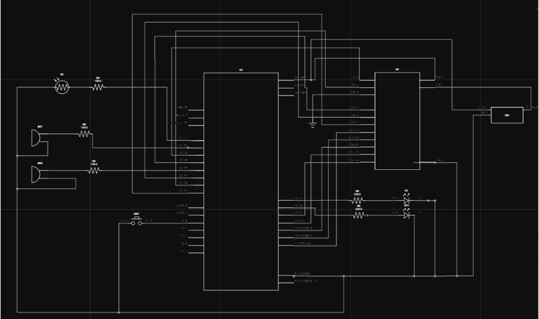

# <h1 align= "center"> **Esquemático del circuito electrónico**</h1>

### Integrantes:
* Said Andre Quispe Diaz
* Hermoza Quispe, Daniel Rodrigo
* Acevedo Valer, Milagros Soledad
* Jander Huamani Salazar
### Lista de contenido:
* [Introducción](#introducción) 
* [Objetivo](#objetivo)
* [Plataforma](#¿cuáles-son-las-ventajas-de-utilizar-la-plataforma-fluxia)
* [Componentes](#componentes-a-utilizar)
* [Desarrollo](#explicación-del-esquema)
* [Esquema](#esquema-del-ejercicio)

### Introducción: 
  El esquemático del circuito electrónico es esencial en todas las etapas del ciclo de vida de un proyecto electrónico, desde el diseño inicial hasta la implementación y el mantenimiento. Proporciona una representación visual clara y concisa que facilita el diseño, análisis, documentación y comunicación de los circuitos electrónicos.
### Objetivo: 
En el presente taller se utilizará la IA Flux como plataforma para la creación del esquemático de circuito eléctrico, en la cual usaremos como mínimo 6 componentes para dicha creación, mencionando el uso que tendrá cada componentes dentro del esquema de circuito eléctrico .
### ¿Cuáles son las ventajas de utilizar la plataforma Flux.ia?
La ventaja que tiene dicha IA con respecto a la competencia es su capacidad para mejorar la eficiencia de creación, automatizar tareas respectivas, optimización del diseño del esquema, detección de errores y proporcionar una experiencia de usuario fácil y accesible. Lo que conduce a un proceso de diseño más rápido, preciso y efectivo en general. 

## Ejercicio con más de 6 componentes
### Componentes a utilizar:
1. **LEDs (Diodo Emisor de Luz):**  
    * **Descripción:** Los LEDs son dispositivos semiconductores que emiten luz cuando una corriente eléctrica pasa a través de ellos en una dirección específica. Son ampliamente utilizados en circuitos electrónicos para indicación visual.

    * **Función en el circuito:** Proporcionan retroalimentación visual al usuario o cumplen una función específica, como indicar el estado de un sistema.

2. **Sensor LDR (Resistor Dependiente de la Luz):** 
    * **Descripción:** Un sensor LDR es un tipo de resistor cuya resistencia varía en función de la intensidad de la luz incidente sobre él. Su resistencia disminuye a medida que aumenta la luz.
    * **Función en el circuito:** Detecta niveles de luz ambiental y puede ser utilizado para activar o desactivar componentes electrónicos en respuesta a cambios en la iluminación.

3. **Buzzer(Zumbador):** 
    * **Descripción:** Un buzzer es un transductor electromecánico que convierte señales eléctricas en sonido. Consiste en un diafragma vibratorio que produce sonido cuando se le aplica corriente eléctrica.
    * **Función en el circuito:** Emite señales audibles para alertar al usuario o indicar ciertas condiciones en el circuito, como alarmas o notificaciones

4. **Botón Pulsador:**
    * **Descripción:** Un botón pulsador es un interruptor momentáneo que se activa al ser presionado y se desactiva cuando se suelta. Cuando está presionado, conecta temporalmente dos terminales eléctricos.
    * **Función en el circuito:** Proporciona una entrada controlada por el usuario para iniciar o detener funciones específicas del circuito, como iniciar un proceso o cambiar un estado.
5. **Resistencia de 10k ohmios:**
    * **Descripción:** Una resistencia de 10k ohmios es un componente electrónico que limita el flujo de corriente en un circuito. Su valor de resistencia es de 10,000 ohmios.
    * **Función en el circuito:** Se utiliza para limitar la corriente en el sensor LDR o en circuitos de pull-up/pull-down para botones pulsadores.
6. **Resistencia de 220 ohmios:**
    * **Descripción:** Una resistencia de 220 ohmios es un componente electrónico que limita el flujo de corriente en un circuito. Su valor de resistencia es de 220 ohmios.
    * **Función en el circuito:** Se utiliza para limitar la corriente en los LEDs, protegiéndolos de daños debido a corrientes excesivas.
7. **Arduino Nano:**
    * **Descripción:** El Arduino Nano es una placa de desarrollo basada en microcontroladores ATmega de Atmel. Tiene un tamaño compacto y proporciona un entorno de desarrollo fácil de usar para proyectos electrónicos.
    * **Función en el circuito:** Controla y coordina las operaciones de los diferentes componentes del circuito mediante el programa cargado en su memoria.
8. **Pantalla:**
    * **Descripción:** Una pantalla es un dispositivo de salida que muestra información visual, como texto, gráficos o números. Puede haber diferentes tipos de pantallas, como LCD (pantallas de cristal líquido), OLED (diodo orgánico emisor de luz) o LED (diodo emisor de luz).
    * **Función en el circuito:** Proporciona retroalimentación visual al usuario mostrando datos relevantes, como valores de sensores, mensajes de estado o resultados de cálculos.
9. **Potenciómetro:**
    * **Descripción:** Un potenciómetro es un dispositivo resistivo con un contacto deslizante que se mueve a lo largo de una pista resistiva. Al ajustar su posición, se puede variar la resistencia eléctrica entre sus terminales.
    * **Función en el circuito:** Permite al usuario ajustar manualmente el valor de resistencia en el circuito, lo que puede controlar características como el brillo de una pantalla, el volumen de un altavoz o la velocidad de un motor.

## **Explicación del esquema**
Se trata de un sistema de alarma que opera mediante la detección de la luminosidad ambiental. Para llevar a cabo esta función, se emplea un sensor LDR (Light Dependent Resistor), el cual activa los zumbadores (buzzers) y los diodos emisores de luz (LEDs) en caso de detectar luz. Además, se utiliza una pantalla LCD para mostrar un mensaje que incluye la hora actual y un texto personalizado.

Para desactivar la alarma y detener el sonido de los zumbadores, se ha incorporado un botón pulsador (push button), el cual al ser accionado apaga tanto los LEDs como los buzzers.

En el diseño del circuito se han incluido resistencias de 10kΩ, 100Ω y 220Ω para garantizar una correcta conversión de energía, evitando así posibles daños a los componentes electrónicos y asegurando un adecuado rendimiento en términos de sonido y luminosidad. También se usó un potenciómetro para ajustar el brillo de la pantalla LCD.

## Esquema del ejercicio

Imagen 1. Esquemático 

[Visualización en Flux.ai](https://www.flux.ai/doncito/advanced-lime-warp-drive?editor=schematic)

## **Conclusión**
En conclusión, hemos desarrollado un sistema de alarma que utiliza un sensor LDR para detectar la luz ambiental y activar los buzzers, LEDs y pantalla LCD. La inclusión de un botón pulsador permite desactivar la alarma fácilmente. Además, hemos cuidado la elección de resistencias para asegurar un funcionamiento eficiente y proteger los componentes electrónicos. Este sistema puede servir para la detección de luz en entornos específicos o como una alarma alternativa.
